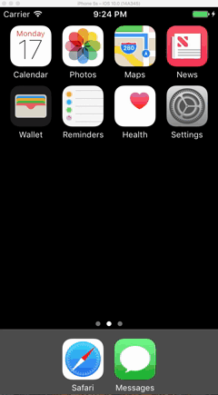

# Flicks

This is an application that uses The Movie DB to display currently playing movies and additional information about them with high quality imagery.

## Description

The app will pull low and then high resolution imagery, scroll infinitely, and handle network errors.

## Codepath Details

Time spent: 7 hours

### User Stories

* [x] Required: User can view a list of movies currently playing in theaters from TMDB
* [x] Required: Poster images are loaded asynchronously
* [x] Required: User can view movie details by tapping on a cell in the UITableView
* [x] Required: User sees loading state while waiting for the movies API via SVProgressHUD.
* [x] Required: User sees an error message when there is a networking error using non 3P/UIAlertController code
* [x] Required: User can pull to refresh the movie list
* [x] Optional: Customize the highlight / selection effect of the UITableView cells (a slight orange background appears and begins to fade during the push animation and selected states are canceled)
* [x] Optional: Customize the navigation bar (the UITableView's bar shows "Now Playing" and the detail view controller's bar shows the title of the movie)
* [x] Optional: Load the low resolution image for the large poster (I took this to mean backdrop) before switching to the high resolution image
* [x] Extra: Infinite scroll in the table view (viewability of the infinite scrolling spinner is not fully managed (and can be seen in the connectivity gif below the UIRefreshControl.
* [x] Extra: Load low res then high res images in the table view cells for the small posters as well.

## Walkthroughs

1. [iPhone 5s Simulator] Shows all functionality except network error state

  

2. [iPhone 5s Simulator] Shows network error behavior and refreshing to get content when networking is back
 
  
